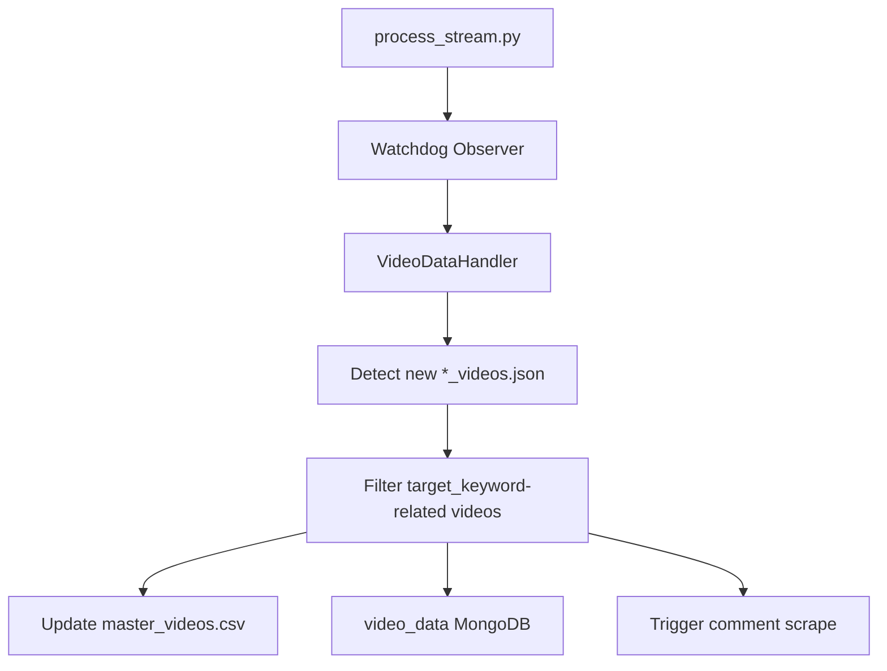

# Youtube Comment Analysis Pipeline

  
  

1. **Initial Channel Scraping (Every ~6 hours via crontab)**

  

2. **Video Processing Stream (Continuous)**

  

3. **Comment Scraping Flow**

  

4. **Analysis Pipeline**

  

1. **Data Collection**:

- `index.js` scrapes channel video listings periodically

- `process_stream.py` watches for new video data and manages the pipeline

- `comment_scrape.js` + `xhr_scrape_ds.py` handle comment collection

  

2. **Data Processing**:

- Videos are filtered for election-related content

- Comments are processed and organized by channel/video

- Geographic attribution is maintained throughout

  

3. **Analysis**:

- `analysis.py` aggregates all data

- `comment_analysis.py` provides specialized content analysis

- Results are stored in MongoDB for the frontend to access

  

4. **MongoDB Collections**:

- `video_data`: Raw video information

- `comments_with_video`: Processed comments with video context

- `state_analysis`: State-level aggregated metrics

- `video_analysis`: Video-level analysis results